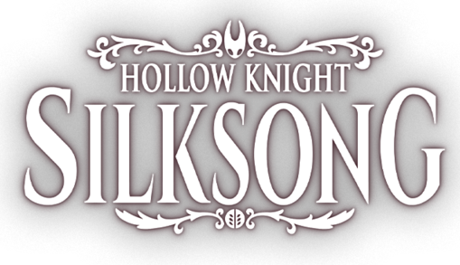

<h1 align="center">Silksong 100% Checklist</h1>

Una checklist interactiva no oficial para seguir tu progreso en <strong>Hollow Knight: Silksong</strong> rumbo al 100%.
 
<a href="https://checklistsilksong.com" target="_blank"><b>Ir a la aplicación →</b></a>

---

## 🌟 ¿Qué es?
Una página sencilla y rápida (sin registros) donde marcas objetos, mejoras, fragmentos, habilidades y otros elementos del juego para saber cuánto te falta. Todo se guarda automáticamente en tu navegador.

## ✨ Características principales
- Progreso automático guardado (localStorage).
- Distinción entre elementos esenciales y opcionales.
- Idiomas: Inglés y Español (cambio instantáneo desde el selector).
- Exportar / importar tu progreso para llevarlo a otro dispositivo.
- Interfaz adaptada a móvil y escritorio.
- Modal de información con tips rápidos.

## 🚀 Cómo usarla
1. Entra a la web y espera que cargue la lista.
2. Marca cada ítem que obtengas en el juego.
3. Observa el porcentaje y los elementos restantes.
4. Exporta tu progreso si quieres una copia de seguridad (botón Export), e impórtalo cuando cambies de dispositivo.
5. Usa el buscador para filtrar ítems rápidamente.

## 🗣 Sugerencias
Si quieres proponer mejoras o avisar de datos incorrectos, abre un issue o pull request en el repositorio.

## 🧩 Traducciones
Actualmente: EN / ES. Si deseas colaborar con otro idioma, abre un issue indicando tu propuesta.

## 🛣 Pequeño roadmap (orientativo)
- Mejoras visuales y accesibilidad.
- Posible añadido de más idiomas.
- Ajustes de datos cuando haya nueva información oficial.

## 🙌 Créditos & Agradecimientos
Proyecto hecho por fans para fans. No afiliado ni respaldado por Team Cherry. Gracias a la comunidad por la recopilación y validación de datos.

## 📄 Privacidad
No pedimos cuentas ni contraseñas. El progreso vive en tu dispositivo. Solo se usan métricas anónimas agregadas para entender uso general.

## ⚖️ Disclaimer
No es un producto oficial de Team Cherry. Hollow Knight: Silksong y todos los elementos relacionados pertenecen a sus respectivos dueños.

## 🛠 ¿Quieres clonar el proyecto?
Es un sitio estático. Puedes abrirlo con cualquier servidor local sencillo. (Detalles técnicos intencionalmente omitidos aquí para mantener el README ligero.)

Hecho con cariño por la comunidad de Silksong 🐛

